# 📌 UpTask

**UpTask** es una plataforma web interactiva para la **gestión de tareas** en proyectos personales o profesionales. Diseñada para **optimizar la productividad**, permite organizar actividades, hacer seguimiento del progreso y mantener un control claro del flujo de trabajo.

Este proyecto ha sido desarrollado como parte de mi proceso de aprendizaje en desarrollo web, aplicando principios sólidos de **backend con PHP**, **seguridad**, **organización del código**, e integración con bases de datos.

---

## 📖 Descripción  

UpTask permite a los usuarios **crear proyectos**, agregar tareas y gestionar su estado de manera ágil e intuitiva. Las tareas pueden filtrarse según su estado (_pendiente_ o _completada_), lo que facilita el seguimiento de los pendientes en cada proyecto.

---

### ⚙️ Características principales

- 🔐 **Autenticación segura**: Registro y login con validación, recuperación de contraseña y protección de rutas.
- 📝 **Gestión de proyectos**: Crea, edita y elimina proyectos fácilmente.
- ✅ **Gestión de tareas**: Añade tareas a proyectos, marca su estado y organízalas visualmente.
- 🔄 **Interactividad con JavaScript**: Actualización dinámica del estado de las tareas sin recargar la página.
- 🔍 **Filtros inteligentes**: Visualiza rápidamente tareas por su estado (pendiente/completada).
- 🧑‍💻 **Gestión de perfil**: Edita nombre, email y contraseña con validaciones en tiempo real.
- 🧩 **Arquitectura MVC**: Código organizado y mantenible gracias a la separación de responsabilidades.
- 📦 **Patrón Active Record**: Manipulación de datos en PHP de forma clara y segura mediante modelos. 

---

## 🔐 Seguridad y buenas prácticas

- Validación de formularios tanto en el cliente como en el servidor.
- Protección de rutas para usuarios autenticados.
- Hashing de contraseñas con funciones seguras.
- Organización del código siguiendo el patrón **MVC**, lo que facilita el mantenimiento y la escalabilidad del proyecto.

---

## 🛠 Tecnologías Usadas  

- 🟢 **PHP** - Lenguaje de programación para el desarrollo del backend.  
- 🗄 **MySQL** - Sistema de gestión de bases de datos relacional.  
- 🌐 **JavaScript** - Lenguaje de programación para la lógica del frontend.  
- 📄 **HTML** - Lenguaje de marcado para la estructura de la página web.  
- 🎨 **CSS** - Hojas de estilo para la presentación visual.  
- 🎨 **SASS** - Extensión de CSS para mayor flexibilidad y organización.  
- 🛠 **Node.js** - Entorno de ejecución para JavaScript, utilizado para los paquetes en el Gulp file. 

---

## 📸 Imágenes del Proyecto

Puedes ver más imagenes [aquí](https://github.com/Gatumbac/UpTask/tree/main/assets).

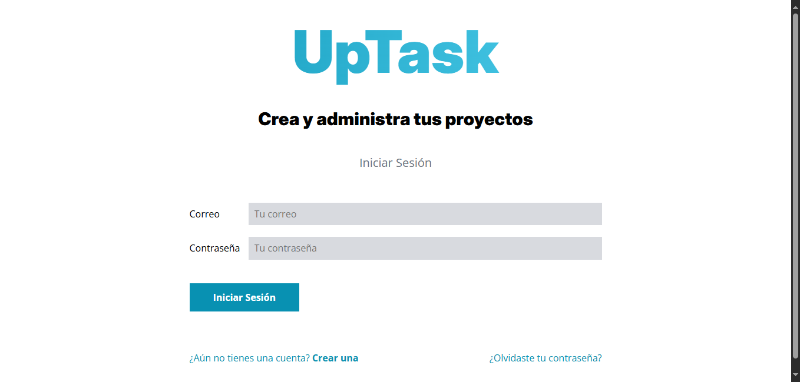
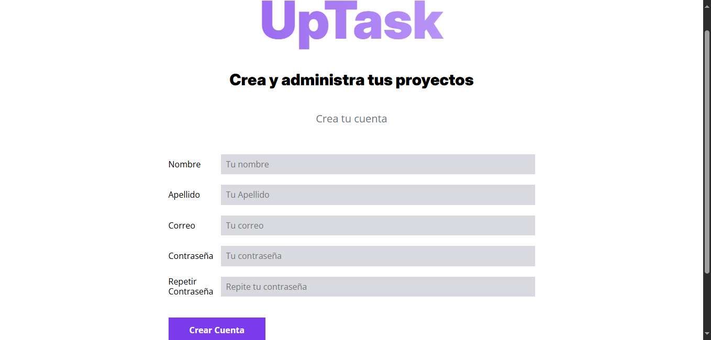
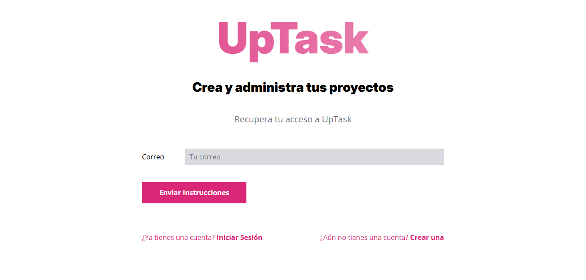
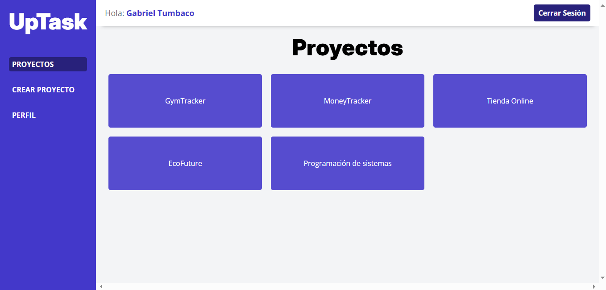
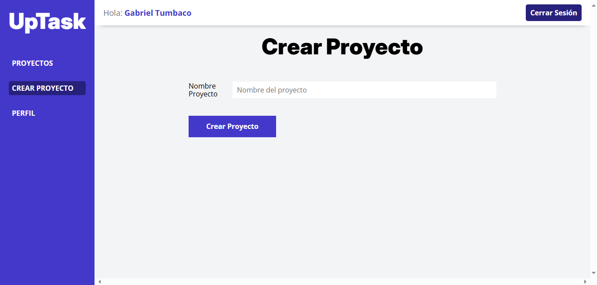
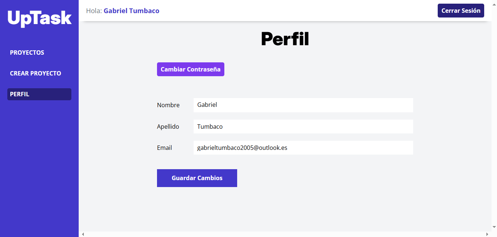

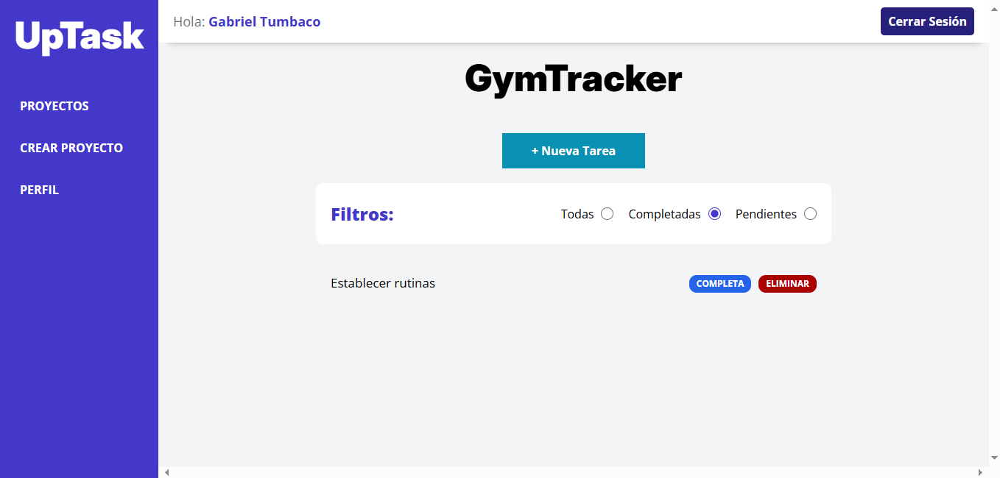
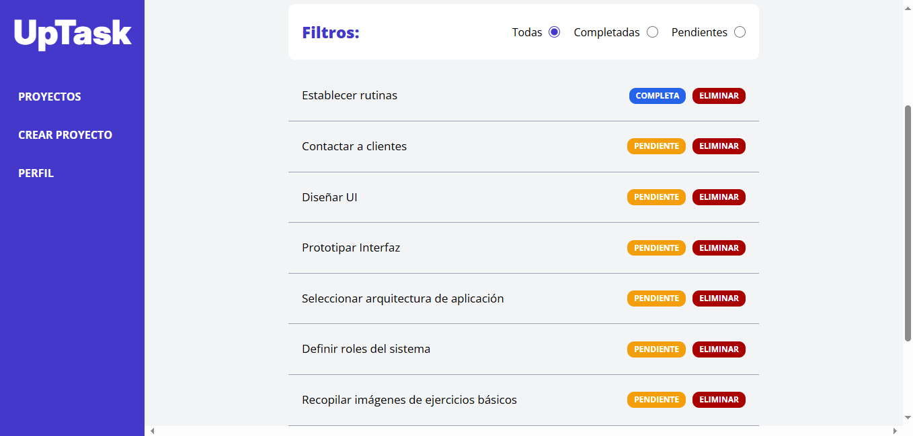
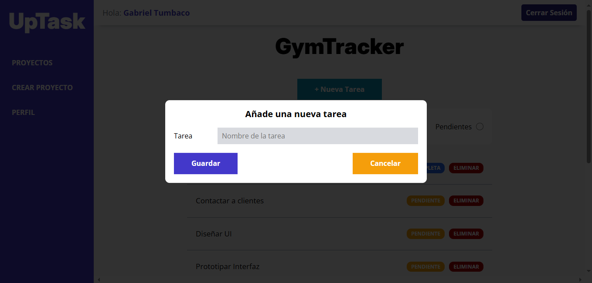
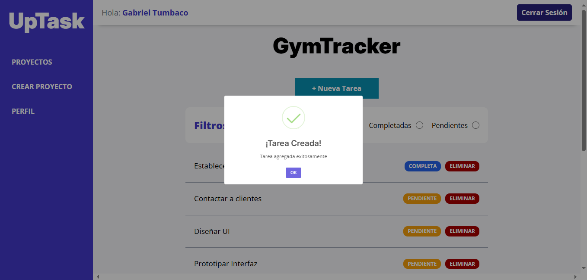
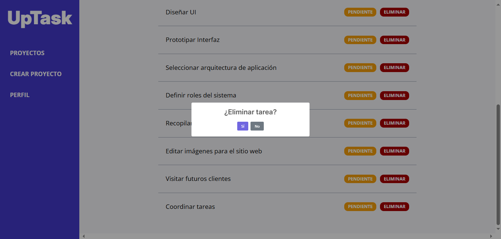
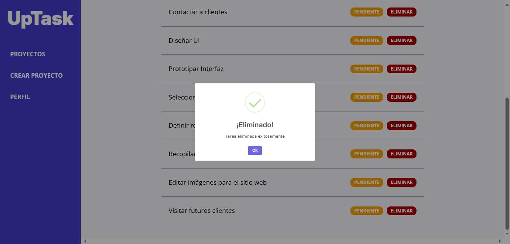
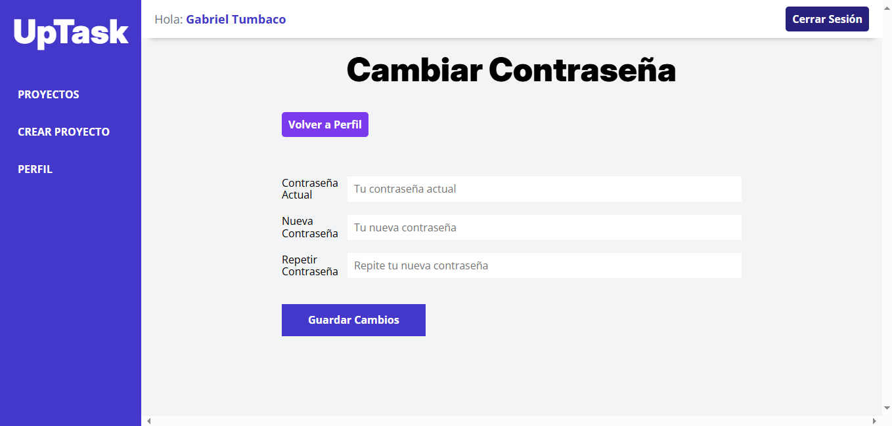

---

## 👨‍💻 Autor  
Desarrollado por **[Gatumbac](https://github.com/Gatumbac)**  
📧 Contacto: gatumbac@espol.edu.ec 
📌 LinkedIn: [Gabriel Tumbaco](https://www.linkedin.com/in/gabriel-tumbaco-santana/)  

---

¡Gracias por visitar el repositorio! Siéntete libre de dar ⭐️ o enviar sugerencias 😊

